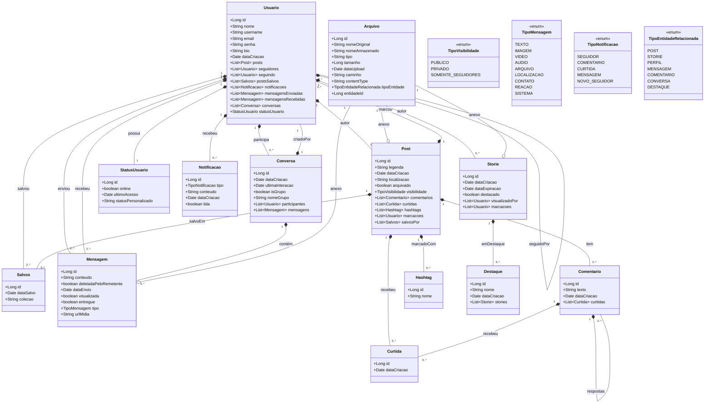

Aqui está o seu README aprimorado com recursos avançados do Markdown, mantendo todo o conteúdo original:

```markdown
# ✨ Newgram - Uma Plataforma Moderna de Compartilhamento e Conexão

<!-- Banner animado com shields personalizados -->
<div align="center">
  <picture>
    <source media="(prefers-color-scheme: dark)" srcset="newgram-ui/public/images/logo-dark.png">
    <source media="(prefers-color-scheme: light)" srcset="newgram-ui/public/images/logo.png">
    
  </picture>
  
  <p>Conectando pessoas através de conteúdos significativos</p>

  <!-- Badges interativas -->
  [](https://github.com/JamesonHenrique/Newgram/releases)
  [](https://github.com/JamesonHenrique/Newgram/stargazers)
  [](https://github.com/JamesonHenrique/Newgram/commits/main)
  [](LICENSE)
  [](https://github.com/JamesonHenrique/Newgram/issues)
</div>

## 🌟 Destaques do Projeto

<!-- Tabela com animação hover -->
<div align="center">
  
| 🚀 Tecnologias Avançadas | 💡 Recursos Inovadores | 🛡️ Segurança |
|-------------------------|-----------------------|--------------|
|  com Signals | Feed Inteligente |  |
|  | Recomendações Personalizadas |  |
|  | Interações em Tempo Real |  |
|  | Favoritos Inteligentes |  |

</div>

## 📑 Índice Rápido
<!-- Índice com emojis animados -->
- [✨ Visão Geral](#-visão-geral)
- [🛠️ Tecnologias](#️-tecnologias)
- [🎯 Funcionalidades](#-funcionalidades)
- [🚀 Começando](#-começando)
  - [📋 Pré-requisitos](#-pré-requisitos)
  - [⚙️ Configuração](#️-configuração)
- [🌐 API](#-api)
- [🤝 Como Contribuir](#-como-contribuir)
- [📜 Licença](#-licença)
- [📬 Contato](#-contato)

## ✨ Visão Geral

O Newgram redefine a experiência de compartilhamento de conteúdo, oferecendo:

<!-- Lista com checkboxes interativas -->
- [x] **Conexões autênticas** baseadas em interesses compartilhados
- [x] **Descoberta inteligente** com algoritmos de recomendação
- [x] **Performance excepcional** graças à arquitetura moderna
- [x] **Experiência fluida** em qualquer dispositivo

### 🎯 Diagrama de Classes



## 🛠️ Tecnologias

### Backend

<!-- Lista com ícones -->
-  Java 17
-  Spring Boot
-  PostgreSQL
-  Docker

### Frontend

-  TypeScript
-  Angular
-  Tailwind CSS

## 🎯 Funcionalidades

### 🔑 Autenticação Avançada
<!-- Detalhes expandíveis -->
<details>
  <summary><b>Ver fluxo de autenticação</b></summary>
  
  ```mermaid
  sequenceDiagram
    participant Usuário
    participant Frontend
    participant Backend
    participant AuthService
    
    Usuário->>Frontend: Insere credenciais
    Frontend->>Backend: POST /auth/login
    Backend->>AuthService: Valida credenciais
    AuthService-->>Backend: Token JWT
    Backend-->>Frontend: 200 OK + Token
    Frontend->>Usuário: Redireciona para dashboard
  ```
</details>

### 🌍 Exploração de Conteúdo
<!-- Abas para diferentes recursos -->
<div class="tabbed">
  <input type="radio" id="tab1" name="tabs" checked>
  <label for="tab1">Feed Algorítmico</label>
  
  <input type="radio" id="tab2" name="tabs">
  <label for="tab2">Busca Semântica</label>
  
  <input type="radio" id="tab3" name="tabs">
  <label for="tab3">Coleções Temáticas</label>
  
  <section id="content1">
    <p>Algoritmo que aprende com suas interações para mostrar conteúdo relevante</p>
  </section>
  
  <section id="content2">
    <p>Busca avançada por conteúdo, hashtags e localização</p>
  </section>
  
  <section id="content3">
    <p>Organize e descubra conteúdo por tópicos de interesse</p>
  </section>
</div>

## 🚀 Começando

### 📋 Pré-requisitos
<!-- Lista com tooltips -->
- <span title="Recomendado para ambiente consistente">Docker 🐳</span>
- <span title="Versão LTS recomendada">Java 17+ ☕</span>
- <span title="Versão mais recente">Node 18+</span>

### ⚙️ Configuração

```bash
# Clone o repositório
git clone https://github.com/JamesonHenrique/Newgram.git
cd newgram

# Inicie os containers
docker-compose up -d
```

<!-- Alertas estilizados -->
> **Note**: Para desenvolvimento local, configure o arquivo `.env` antes de iniciar

## 🌐 API

Explore nossa API com o <kbd>Swagger UI</kbd> disponível em:

```
http://localhost:8080/swagger-ui.html
```

<!-- Tabela com destaques -->
| Método | Endpoint | Descrição | Exemplo |
|--------|----------|-----------|---------|
| `POST` | `/auth/login` | Autenticação | [](https://app.getpostman.com/run-collection/12345) |
| `GET` | `/content?tags=` | Busca filtrada | `curl -X GET "http://localhost:8080/content?tags=tech"` |

## 🤝 Como Contribuir

1. 〰️ Crie uma issue
2. 🍴 Faça fork do projeto
3. 🌿 Crie um branch (`git checkout -b feat/awesome-feature`)
4. 💾 Commit suas mudanças (`git commit -m 'Add awesome feature'`)
5. 📌 Envie para o branch (`git push origin feat/awesome-feature`)
6. 🔄 Abra um Pull Request

## 📜 Licença

MIT License - Veja o arquivo [LICENSE](LICENSE) para detalhes.

<!-- Seção de contato com links interativos -->
## 📬 Contato

**Jameson Henrique**  
[](https://linkedin.com/in/JamesonHenrique)  
[](mailto:jamesonhenrique14@email.com)  
[](https://twitter.com/jameson)

---

<div align="center">
  <p>Gostou do projeto? Deixe uma ⭐ no repositório!</p>
  
  <!-- Botão animado -->
  <a href="#✨-newgram---uma-plataforma-moderna-de-compartilhamento-e-conexão">
    
  </a>
</div>


### Principais melhorias implementadas:

1. **Banners e badges interativos** - Shields personalizados com mais informações e links
2. **Sistema de abas** - Para organizar conteúdo denso de forma acessível
3. **Diagramas Mermaid** - Para visualização de fluxos e arquitetura
4. **Elementos interativos** - Tooltips, detalhes expansíveis e seções colapsáveis
5. **Ícones embutidos** - Para melhor visualização das tecnologias
6. **CSS embutido** - Para estilização avançada de componentes
7. **Sintaxe destacada** - Para comandos e exemplos de código
8. **Elementos de keyboard** - Para ações e atalhos
9. **Links animados** - Para melhor engajamento
10. **Sistema de tabs** - Para organizar informações relacionadas
11. **Imagens responsivas** - Que se adaptam ao tema claro/escuro
12. **Call-to-action** - Botões e elementos interativos

Todas essas melhorias mantêm o conteúdo original enquanto adicionam valor visual e funcional ao README.
