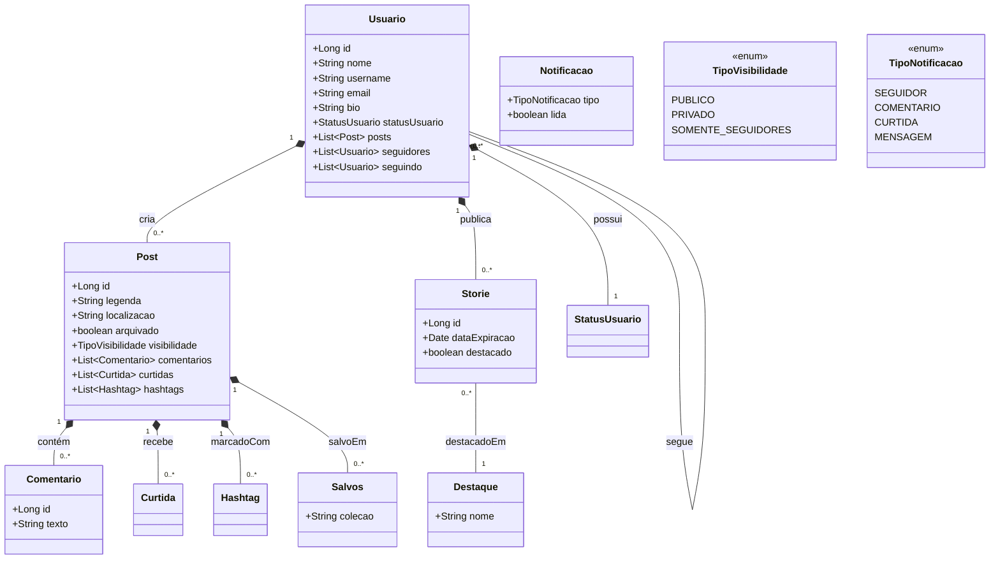

<div align="center">


# ✨ Newgram

**Rede social full stack — feed, stories, seguidores e descoberta de conteúdo.**

[](https://newgram-nine.vercel.app/)


</div>

---

## 📑 Índice

- [Sobre](#-sobre)
- [Funcionalidades](#-funcionalidades)
- [Arquitetura](#️-arquitetura)
- [Stack](#️-stack)
- [API](#-api)
- [Começando](#-começando)
- [Licença](#-licença)
- [Contato](#-contato)

---

## ✨ Sobre

O **Newgram** é uma rede social inspirada no Instagram, construída como um projeto full stack completo — de um back-end em **Spring Boot** com arquitetura em camadas a um front-end **Angular** que consome uma API gerada a partir do contrato OpenAPI.

A ideia foi ir além do CRUD: modelar um domínio social real (posts, stories, destaques, seguidores, curtidas, comentários, hashtags, notificações e coleções de salvos), com autenticação segura, upload de mídia em nuvem e um feed com diferentes estratégias de descoberta.

---

## 🎯 Funcionalidades

- **Autenticação JWT** com *access token* e *refresh token*, filtros de segurança próprios e tratamento de acesso negado / não autenticado.
- **Feed e descoberta de conteúdo:** posts de quem você segue, populares, em alta (tendências), recomendados e por localização.
- **Busca:** posts por legenda e usuários por nome/username, com paginação.
- **Posts:** criação com mídia, curtir/descurtir, salvar em **coleções**, arquivar/desarquivar, filtro por hashtag.
- **Stories e Destaques:** publicação temporária e organização de stories em destaques no perfil.
- **Grafo social:** seguir/deixar de seguir, listas de seguidores/seguidos, **sugestões de quem seguir** (perfis mais populares e seguidos em comum).
- **Comentários, curtidas e hashtags.**
- **Notificações** de interações (seguidor, curtida, comentário).
- **Upload de mídia na AWS S3** com entrega por *presigned URLs* de expiração configurável.
- **Perfis de usuário** com status (online / último acesso) e bio.
- **Documentação da API** via Swagger (OpenAPI 3).

---

## 🏗️ Arquitetura

O back-end segue uma separação em camadas para isolar regra de negócio de framework e infraestrutura:

```
com.jhcs.newgram
├── presentation   → Resources REST (controllers) — a borda HTTP
├── application    → Services + DTOs — orquestração de casos de uso
├── core.domain    → Entities, Enums e Repositories — o coração do domínio
└── infrastructure → Security (JWT), AWS S3, config, exception handling
```

<details>
<summary>📐 Diagrama de classes do domínio</summary>



</details>

---

## 🛠️ Stack

**Back-end**
- Java 17 · Spring Boot 3.4.4
- Spring Web · Spring Data JPA · Spring Security
- Autenticação JWT (JJWT — access + refresh)
- PostgreSQL · Flyway (migrations versionadas)
- AWS SDK S3 (upload + presigned URLs)
- springdoc-openapi (Swagger UI) · Lombok
- Pool Hikari e batch inserts JPA ajustados
- Docker (build multi-stage: Maven → Temurin JRE Alpine)

**Front-end**
- Angular 19 · TypeScript · RxJS
- `ng-openapi-gen` (client TS gerado do OpenAPI)
- `@auth0/angular-jwt` · Tailwind CSS · animate.css · ngx-toastr

---

## 🔌 API

Base de recursos REST (documentação completa e testável no **Swagger UI**):

| Recurso | Base | Destaques |
| --- | --- | --- |
| Autenticação | `/auth` | login, refresh token |
| Usuários | `/usuarios` | perfil, busca, sugestões, mais populares |
| Posts | `/posts` | feed, populares, recomendados, tendências, busca, salvos/coleções, curtir, arquivar |
| Stories | `/stories` | publicação e visualização |
| Destaques | `/destaques` | organização de stories no perfil |
| Comentários | `/comentarios` | comentar e curtir comentários |
| Seguidores | `/seguidores` | seguir, listar, sugerir |
| Hashtags | `/hashtags` | busca e navegação por tag |

```
Swagger UI → http://localhost:8080/swagger-ui.html
```

---

## 🚀 Começando

### Pré-requisitos
- Java 17+ e Maven
- Node.js + npm e Angular CLI
- PostgreSQL
- Um bucket AWS S3 (para upload de mídia)

### Variáveis de ambiente (back-end)

Nunca commite segredos: copie `.env.example` para `.env` e exporte (ou use `docker-compose.yml`
para Postgres + MinIO locais). Gere o segredo JWT com `openssl rand -base64 32`.

```bash
DATABASE_URL=jdbc:postgresql://localhost:5432/newgram
DATABASE_USERNAME=newgram
DATABASE_PASSWORD=troque-esta-senha
JWT_SECRET=<saida-do-openssl-rand-base64-32>
AWS_ACCESS_KEY_ID=
AWS_SECRET_ACCESS_KEY=
AWS_REGION=us-east-1
AWS_S3_BUCKET=newgram-dev
# AWS_S3_ENDPOINT=http://localhost:9000   # MinIO local
# APP_CORS_EXTRA=https://meu-dominio.com
```

Contrato de auth: access token 15 min + refresh 7 dias **com rotação**
(reuso do refresh antigo é rejeitado). Presigned URLs S3 expiram em 60 min.

> As migrations do Flyway criam o schema e populam dados de exemplo automaticamente na primeira execução.

### Back-end

```bash
# via Maven
./mvnw spring-boot:run

# ou via Docker
docker build -t newgram .
docker run -p 8080:8080 newgram
```
Servidor em `http://localhost:8080`.

### Front-end

```bash
cd newgram-ui
npm install

# gera o client TypeScript a partir do OpenAPI do back-end (precisa dele no ar)
npx ng-openapi-gen

ng serve
```
Aplicação em `http://localhost:4200`.

---

## 📜 Licença

Distribuído sob a licença **MIT**. Veja [LICENSE](LICENSE).

---

## 📬 Contato

**Jameson Henrique**

[](https://linkedin.com/in/JamesonHenrique)
[](mailto:jameson.henrique.dev@gmail.com)


<div align="center">

Gostou? Deixa uma ⭐

</div>
