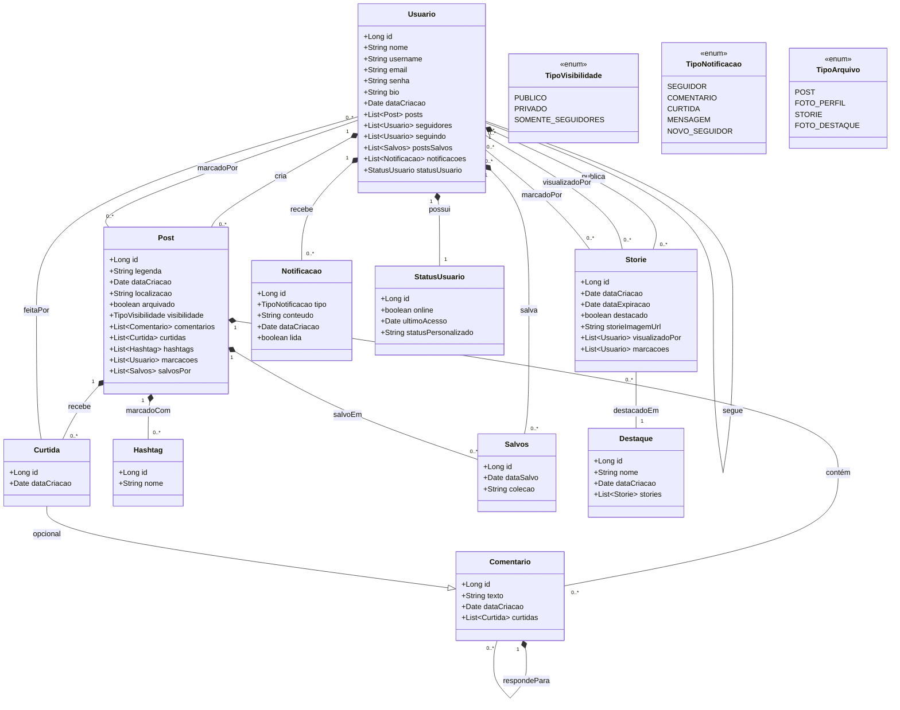

# ✨ Newgram - Uma Plataforma Moderna de Compartilhamento e Conexão

<div align="center">
  <picture>
    <source  srcset="newgram-ui/public/images/logo.png">
    
  </picture>

  <p>Conectando pessoas através de conteúdos significativos</p>

[](https://newgram-nine.vercel.app/)

</div>

## 🌟 Destaques do Projeto

<div align="center">

| 🚀 Tecnologias Avançadas | 💡 Recursos Inovadores | 🛡️ Segurança |
|-------------------------|-----------------------|--------------|
| Angular | Feed Inteligente | JWT Authentication |
| Spring Boot | Recomendações Personalizadas | Spring Security |
| Tailwind CSS | Design Incrivel | Dados Seguros |
| PostgreSQL | Favoritos Inteligentes | Protegido de Ataques |

</div>

## 📑 Índice Rápido
- [✨ Visão Geral](#-visão-geral)
- [🛠️ Tecnologias](#️-tecnologias)
- [🎯 Funcionalidades](#-funcionalidades)
- [🚀 Começando](#-começando)
  - [📋 Pré-requisitos](#-pré-requisitos)
  - [⚙️ Configuração](#️-configuração)
- [🌐 API](#-api)
- [🤝 Como Contribuir](#-como-contribuir)
- [📜 Licença](#-licença)
- [📬 Contato](#-contato)

## ✨ Visão Geral

O Newgram redefine a experiência de compartilhamento de conteúdo, oferecendo:

- **Conexões autênticas** baseadas em interesses compartilhados
- **Descoberta inteligente** com algoritmos de recomendação
- **Performance excepcional** graças à arquitetura moderna
- **Experiência fluida** em qualquer dispositivo

### 🎯 Diagrama de Classes



## 🛠️ Tecnologias


### Backend

- Java 17
- Spring Boot
- Spring Security
- Spring Data JPA
- PostgreSQL
- Flyway
- Maven
- Swagger
- JWT Authentication
- AWS
- S3

### Frontend

- TypeScript
- Angular
- RxJS
- Animate CSS
- Tailwind CSS
- Angular JWT
- NG-Openapi-Gen
  
## 🎯 Funcionalidades

### 🔑 Autenticação Avançada
- Token e Refreshs token seguros
- Gerenciamento de erros

### 🌍 Exploração de Conteúdo
- **Feed infinito** - Aparece mais posts, até acabar todos
- **Busca semântica** - Encontre o que realmente importa
- **Criar Posts, stories e destaques** - Apresente ao mundo o que deseja

### ❤️ Sistema de Favoritos
- Tags inteligentes
- Organização visual

## 🚀 Começando

### 📋 Pré-requisitos

- Java
- Angular
- PostgreSQL 

## Instalação

### Backend

1. Clone o repositório:

```bash
git clone https://github.com/JamesonHenrique/Newgram.git
cd newgram
```

2. Configure o banco de dados PostgreSQL no arquivo `src/main/resources/application.properties`

3. Execute o backend:

```bash
mvn spring-boot:run
```

O servidor estará disponível em `http://localhost:8080`

### Frontend

1. Navegue até a pasta do frontend:

```bash
cd newgram-ui
```

2. Instale as dependências:

```bash
npm install
```

3. Execute o frontend:

```bash
ng serve
```

A aplicação estará disponível em `http://localhost:4200`

## 🌐 API

A documentação da API está disponível através do Swagger UI:

```
http://localhost:8080/swagger-ui.html
```

## 🤝 Como Contribuir

Siga nosso fluxo de colaboração:

1. Crie uma issue descrevendo sua proposta
2. Faça fork do projeto
3. Crie um branch descritivo (`feat/new-auth-flow`)
4. Envie seu PR com:
   - Descrição clara
   - Screenshots (se aplicável)
   - Testes atualizados

## 📜 Licença

MIT License - Veja o arquivo [LICENSE](LICENSE) para detalhes.

## 📬 Contato

**Jameson Henrique**  
[](https://linkedin.com/in/JamesonHenrique)  
[](mailto:jamesonhenrique14@email.com)

---


<div align="center">
  <p>Gostou do projeto? Deixe uma ⭐ no repositório!</p>

  <a href="#-newgram---uma-plataforma-moderna-de-compartilhamento-e-conexão">
    
  </a>
</div>
